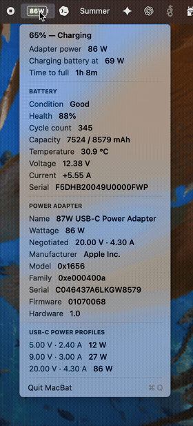

# MacBook Charger Power Indicator

A tiny macOS menu-bar app that shows your battery — and, when a charger is
plugged in, the **charging power in watts**.

## Demo

<p align="center">
  <br><br>
  
</p>

## What it does

- **On battery:** a battery icon with the charge **percentage** inside it.
- **Plugged in:** the icon turns green and shows the adapter's **wattage**
  (e.g. `86W`) instead of the percentage.
- **Click it** for a dropdown with the details:
  - **Battery** — condition, health, cycle count, capacity, temperature,
    voltage, current.
  - **Power Adapter** — name, wattage, negotiated voltage/current,
    manufacturer, model, serial, firmware.
  - **USB-C Power Profiles** — the voltage/current levels the charger supports.

It reads everything locally from macOS (IOKit). Nothing is sent anywhere.

## Run it

```sh
./build-app.sh   # build "MacBook Charger Power Indicator.app" into build/
open "build/MacBook Charger Power Indicator.app"   # launch into the menu bar
```

To start it automatically at login:

```sh
./install-login-item.sh
```

It runs as a background app — no Dock icon, no window, just the menu-bar item.
Quit it from its own dropdown (**Quit**).

## Build a shareable copy

```sh
./package.sh   # creates dist/MacBook-Charger-Power-Indicator.dmg and .zip
```

## License

MIT — © 2026 Peter Kuhar ([@pkuhar](https://github.com/pkuhar)). See [LICENSE](LICENSE).
